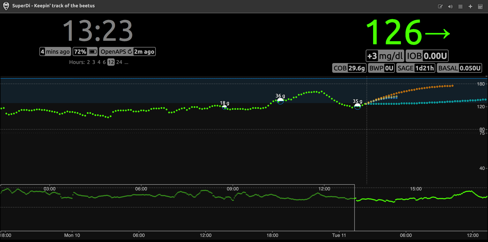
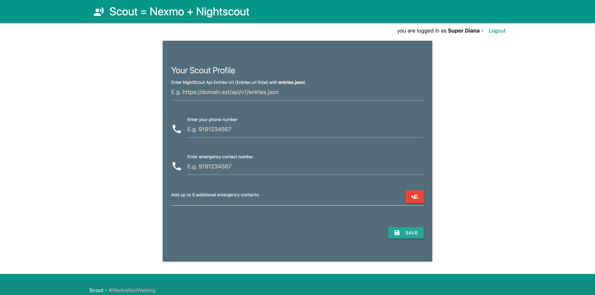

# Scout: Nexmo + Nightscout

An app to notify your preferred emergency contacts in case your blood glucose values from Nightscout are  out of range.
This app uses the Nexmo messages and voice api's and is written in Flask.

If your values are out of range (significantly low or high) You will get a phone call alerting you and reading your blood glucose over the phone. In the event of not answering the call your preferred emergency contact(s) will receive an SMS notifying them you are out of range

## EuroPython 2020 #Tech4Good Challenge

Check [THIS README](https://nexmo.dev/europython2020) for instructions!!


## Context

I have type 1 diabetes. With all the amazing open source initiatives, this is a good way to notify my contacts should i become unresponsive due to being too high or too low. All the data comes from my nightscout dasbhoard:(If you want to check my blood glucose values in real time go to https://dianux.superdi.dev)




Although the initial state of this app is very basic, it's work in progress and you're more than welcome to contribute. The idea is to add more configuration options and improve the UI.



## Deploying to Heroku

Before you start deploying your App using the Heroku Deploy Button. You need to get the nexmo credentials from [Vonage dashboard](https://dashboard.nexmo.com/). Using the firebase console get the [Firebase database secrets](https://firebase.google.com/) and from google cloud get the [google client id](https://console.cloud.google.com/apis/credentials) needed for auth using the client. Two of this credentials could be `filepaths`, but this is not useful at the moment of deploying the application from a repository because of security reasons. That's why we are going to pass the `nexmo application private key` in a single line as a environment variable and the `firebase database secrets` also as a json string in a single line.

Download your private key file from the communications dashboard and run the following command:

```
awk 'NF {sub(/\r/, ""); printf "%s\\n",$0;}' ./private.key
```

This command is going to retrieve the private key in a single line.

For the `firebase secrets json` file just put the content in a single line. Copy and paste it in the `FIREBASE_PRIVATE_KEY` field. The content sould look like this:

```json
{"type": "xxxxx","project_id": "xxxxx","private_key_id": "xxxxx","private_key": "xxxxx","client_email": "xxxxx","client_id": "xxxxx","auth_uri": "xxxxx","token_uri": "xxxxx","auth_provider_x509_cert_url": "xxxxx","client_x509_cert_url": "xxxxx"}

```

When clicking on the the deploy button:

[](https://heroku.com/deploy?template=https://github.com/nexmo-community/nexmo-scout)

You will see something like this:


Please fill the fields with the corresponding data. 

## Contributing

All contributions are welcome. Make sure you follow the [code of conduct](CODE_OF_CONDUCT.MD) in this repository. 
